**A real-world microservices architecture built with Docker, demonstrating container orchestration, API integration, and DevOps best practices.**

[](https://www.docker.com/)
[](https://www.python.org/)
[](https://flask.palletsprojects.com/)
[](https://www.nginx.com/)

> **Built as a hands-on learning project** to master Docker fundamentals before diving into Kubernetes. This project aggregates live NBA/NFL scores, weather data, and news headlines through a clean, responsive dashboard running in isolated, scalable containers.

---

## 📋 Table of Contents

- [Why This Project?](#-why-this-project)
- [What I Built](#-what-i-built)
- [Tech Stack](#-tech-stack)
- [Architecture](#-architecture)
- [Getting Started](#-getting-started)
- [The Journey: Challenges & Solutions](#-the-journey-challenges--solutions)
- [Container Management Deep Dive](#-container-management-deep-dive)
- [Live Dashboard](#-live-dashboard)
- [What I Learned](#-what-i-learned)
- [Next Steps](#-next-steps)

---

## 🎯 Why This Project?

### The Problem with Monolithic Architecture

In legacy monolithic setups, a single update can bring down the entire application. Every change is risky because all components are tightly coupled—one bug affects everything.

**Real-world impact:**
- 🔴 Entire site goes down for a single service update
- 🔴 Rolling back requires redeploying everything
- 🔴 Scaling means duplicating the entire application
- 🔴 Teams can't work independently

### The Docker Solution

Docker enables microservices architecture where each service runs in its own isolated container:

**Benefits:**
- ✅ Update the checkout service without touching the shopping cart
- ✅ Scale only the services that need it
- ✅ Roll back individual services independently
- ✅ Teams can develop and deploy in parallel

**Example:** On an e-commerce platform with separate containers for browsing, cart, checkout, and database—if the browsing container breaks, customers can still complete purchases. Simply revert that one container while other services continue running.

### My Goal

Learn Kubernetes by first mastering the underlying container technology it orchestrates. You can't manage what you don't understand.

---

## 🏗️ What I Built

A **live sports and news aggregation dashboard** that pulls data from multiple APIs and displays it through a clean, responsive interface—all containerized for easy deployment and scaling.

### Features

- 🌤️ **Real-time weather** for Charlotte, NC via OpenWeather API
- 🏀 **Live NBA scores** from ESPN API
- 🏈 **Live NFL scores** from ESPN API  
- 📰 **Breaking news headlines** from NewsAPI
- 🔄 **Auto-refresh** every 60 seconds
- 📱 **Responsive design** that works on any device

### Why These Technologies?

| Component | Purpose | Why I Chose It |
|-----------|---------|----------------|
| **ESPN API** | Live sports scores | Free, no authentication, real-time data |
| **OpenWeather API** | Weather data | Industry standard, generous free tier |
| **NewsAPI** | News headlines | Simple REST API, comprehensive coverage |
| **Flask** | Backend API | Lightweight Python framework, easy to learn |
| **Nginx** | Frontend & Proxy | Production-grade web server, efficient static file serving |
| **Docker** | Containerization | Industry standard, essential DevOps skill |

---

## 🛠️ Tech Stack

### Backend
- **Python 3.11** - Modern, stable Python version
- **Flask 3.0** - Lightweight web framework for REST API
- **Requests** - HTTP library for API calls
- **Flask-CORS** - Cross-Origin Resource Sharing support

### Frontend
- **HTML5/CSS3** - Modern, semantic markup
- **Vanilla JavaScript** - No framework overhead, fast loading
- **Nginx Alpine** - Lightweight web server (5MB vs 100MB+ for full Nginx)

### Infrastructure
- **Docker 24+** - Container runtime
- **Docker Compose 2.0** - Multi-container orchestration
- **Nginx** - Reverse proxy for routing

### APIs (All Free Tier)
- ESPN API - Sports scores (unlimited)
- OpenWeather API - Weather data (1,000 calls/day)
- NewsAPI - Headlines (100 calls/day)

---

## 🏛️ Architecture

### High-Level Overview
```
┌─────────────────────────────────────────────────────────────┐
│                         User Browser                         │
│                     http://localhost:80                      │
└───────────────────────────────┬─────────────────────────────┘
                                │
                    ┌───────────▼───────────┐
                    │   Nginx Proxy :80     │
                    │  (Reverse Proxy)      │
                    └───────────┬───────────┘
                                │
                ┌───────────────┼───────────────┐
                │               │               │
        ┌───────▼──────┐ ┌─────▼──────┐ ┌─────▼─────┐
        │  Frontend:80 │ │Backend:5000│ │           │
        │   (Nginx)    │ │  (Flask)   │ │  External │
        │   Serves     │ │   Calls    │ │    APIs   │
        │  HTML/CSS/JS │ │  ESPN      │ │           │
        └──────────────┘ │  Weather   │ └───────────┘
                         │  NewsAPI   │
                         └────────────┘
```

### Container Architecture
```
┌─────────────────────── Docker Host ───────────────────────┐
│                                                            │
│  ┌────────────────── app-network (bridge) ──────────────┐│
│  │                                                        ││
│  │  ┌──────────────┐  ┌──────────────┐  ┌─────────────┐││
│  │  │nginx_proxy   │  │sports_backend│  │sports_      │││
│  │  │              │  │              │  │frontend     │││
│  │  │Image: nginx  │  │Image: custom │  │Image: custom│││
│  │  │Port: 80      │  │Port: 5001    │  │Port: 3000   │││
│  │  │              │  │→5000 internal│  │→80 internal │││
│  │  └──────────────┘  └──────────────┘  └─────────────┘││
│  │                                                        ││
│  └────────────────────────────────────────────────────────┘│
└────────────────────────────────────────────────────────────┘
```

### Request Flow

1. **User visits** `http://localhost`
2. **Nginx Proxy** receives request on port 80
3. **Routing decision:**
   - Path `/` → Forward to **frontend** container
   - Path `/api/*` → Forward to **backend** container
4. **Frontend** serves HTML/CSS/JS to browser
5. **Browser JavaScript** makes API calls to `/api/nba/scores`, etc.
6. **Nginx Proxy** forwards API calls to **backend**
7. **Backend** fetches data from external APIs (ESPN, Weather, News)
8. **Response** flows back through proxy to browser

### Why This Architecture?

**✅ Separation of Concerns**
- Frontend handles UI/UX
- Backend handles business logic and API integration
- Nginx handles routing and load distribution

**✅ Independent Scaling**
- Scale frontend for high traffic (static files)
- Scale backend for API-heavy workloads
- Each service scales based on its own needs

**✅ Easy Maintenance**
- Update frontend without touching backend
- Add new API endpoints without frontend changes
- Switch out any service with minimal impact

**✅ Production-Ready**
- Same architecture used by companies like Netflix, Uber
- Easy migration to Kubernetes
- Supports health checks, auto-restart, logging

---

## 🚀 Getting Started

### Prerequisites

- **Docker Desktop** - [Download here](https://www.docker.com/products/docker-desktop)
- **API Keys** (free):
  - [OpenWeather API](https://openweathermap.org/api) - Weather data
  - [NewsAPI](https://newsapi.org/) - News headlines

### Quick Start

1. **Clone the repository:**
```bash
   git clone https://github.com/vonongit/docker-sports-news-dashboard.git
   cd docker-sports-news-dashboard
```

2. **Add your API keys:**
   
   Edit `backend/app.py` and add your keys:
```python
   WEATHER_API_KEY = 'your_openweather_key_here'
   NEWS_API_KEY = 'your_newsapi_key_here'
```

3. **Start the application:**
```bash
   docker-compose up --build
```

4. **Open your browser:**
```
   http://localhost
```

That's it! 🎉

### File Structure
```
docker-sports-news-dashboard/
├── backend/
│   ├── app.py              # Flask API with ESPN, Weather, News endpoints
│   ├── requirements.txt    # Python dependencies
│   └── Dockerfile          # Multi-stage build for optimized image
├── frontend/
│   ├── index.html          # Dashboard UI (HTML/CSS/JS)
│   ├── nginx.conf          # Nginx config for serving static files
│   └── Dockerfile          # Nginx Alpine image
├── nginx/
│   └── nginx.conf          # Reverse proxy routing configuration
├── docker-compose.yml      # Orchestrates all 3 containers
├── README.md               # Project overview
├── DOCUMENTATION.md        # This file
└── screenshots/            # Documentation images
```

---

## 🔧 The Journey: Challenges & Solutions

### Challenge 1: File Naming Issue

**❌ Problem**

First build attempt failed with `app.py not found`:
```bash
docker-compose up --build
# Error: COPY failed: file not found: /backend/app.py
```

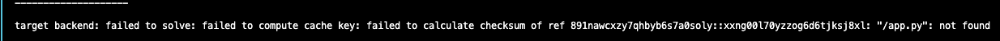

**🔍 Root Cause**

I named the file `app-api.py` instead of `app.py`, but the Dockerfile was looking for `app.py`.

**✅ Solution**

1. **Identified the issue** by reading error logs carefully
2. **Found the leftover image** from failed build:
```bash
   docker images
   # Found: docker-sports-news-dashboard-backend 
```
3. **Cleaned up the failed image:**
```bash
   docker rmi abc123def456  # Used actual image ID
```
   
   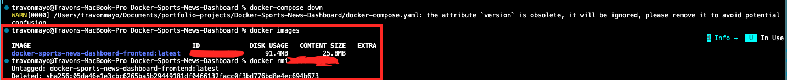

4. **Fixed the root cause:**
```bash
   mv backend/app-api.py backend/app.py
```

5. **Rebuilt successfully:**
```bash
   docker-compose up --build
```

**💡 Lesson Learned**

Docker is case-sensitive and will fail silently if files don't exist. Read error messages carefully—they tell you exactly what's wrong.

---

### Challenge 2: Port Conflict with macOS

**❌ Problem**

Second build failed with port binding error:
```bash
Error: bind: address already in use
Port 5000 is already allocated
```

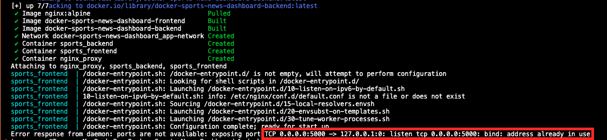

**🔍 Root Cause Investigation**

1. **Checked what was using port 5000:**
```bash
   lsof -i :5000
   # Result: ControlCenter (macOS AirPlay Receiver)
```

**You can see in the screenshot below that the port is being used by Apple's control center:**


2. **Discovered:** macOS Monterey and later use port 5000 for AirPlay by default. This is a known issue for Mac developers.

**✅ Solution**

Modified port mapping in `docker-compose.yml`:
```yaml
# Before
backend:
  ports:
    - "5000:5000"  # ❌ Conflicts with macOS

# After
backend:
  ports:
    - "5001:5000"  # ✅ External port 5001, internal still 5000
```

**How it works:**
- Container internally still uses port 5000
- Accessible externally on port 5001
- No conflicts with macOS services

**🔄 Steps taken:**

1. **Stop existing containers:**
```bash
   docker-compose down
```

2. **Update docker-compose.yml** with new port mapping

3. **Rebuild and restart:**
```bash
   docker-compose up --build
```

4. **Success** All 3 containers started:

   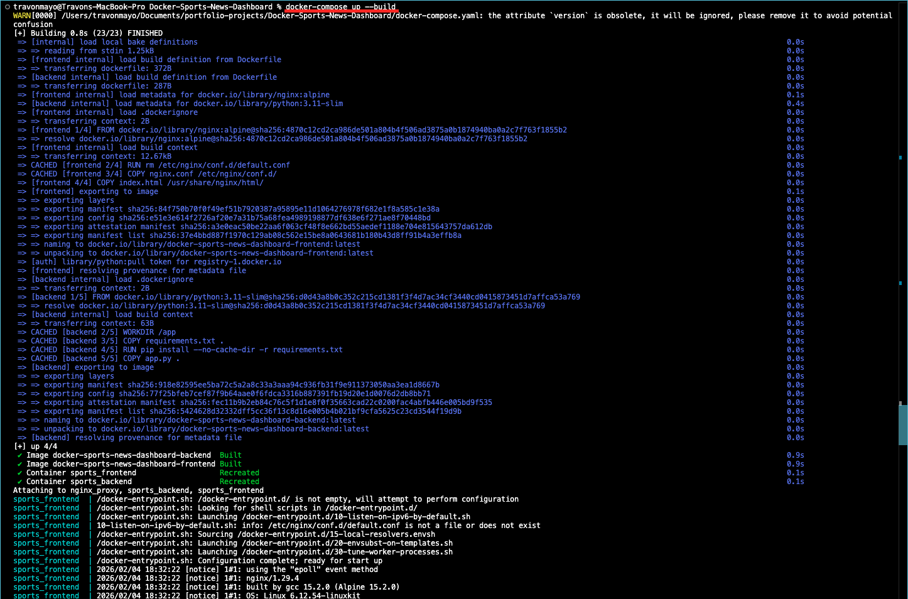
   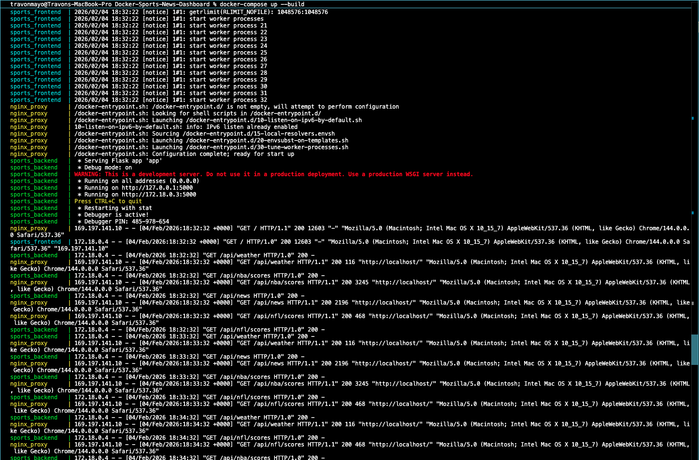
   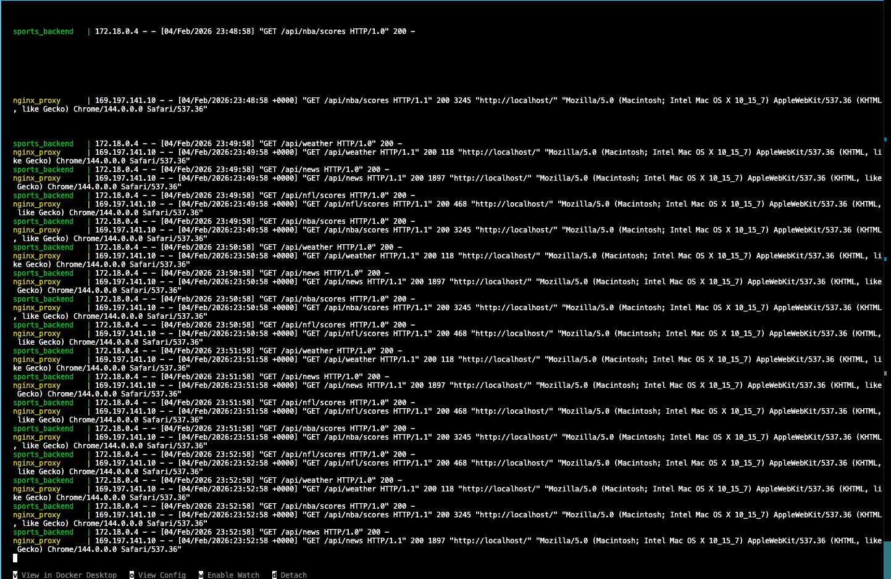

**💡 Lesson Learned**

Always check for port conflicts before deploying. On Mac, avoid ports 5000, 7000, and other system-reserved ports. Use `lsof -i :<port>` to diagnose quickly.

**Alternative solutions:**
- Disable AirPlay Receiver in System Settings (not recommended)
- Use different ports (recommended)
- Use Docker host networking mode (advanced)

---

## 📊 Container Management Deep Dive

### Visual Overview in Docker Desktop

**Container Group View:**

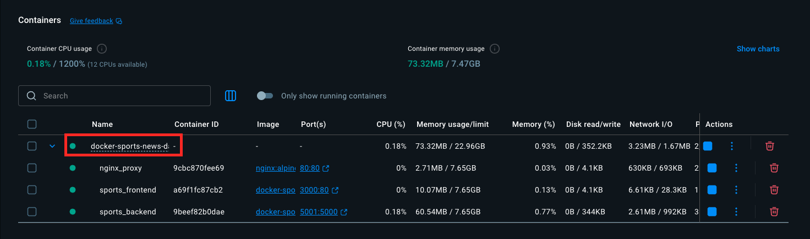

Docker Desktop groups containers from the same `docker-compose.yml` project for easy management. Expand the arrow to see individual containers.

---

### Understanding Container Logs

**What Logs Tell You:**

Container logs show real-time output from your application—startup messages, errors, API calls, and health status.

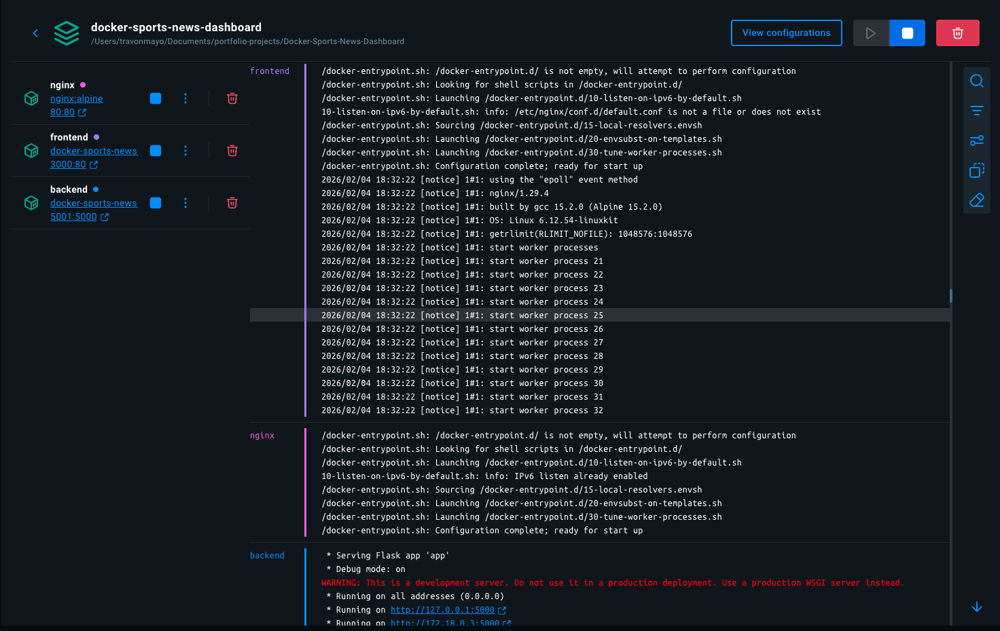

**Key log patterns:**

| Log Message | Meaning | Status |
|-------------|---------|--------|
| `Configuration complete; ready for start up` | Nginx initialized successfully | ✅ Good |
| `* Running on http://127.0.0.1:5000` | Flask backend is listening | ✅ Good |
| `start worker processes` | Nginx worker threads created | ✅ Good |
| `WARNING: This is a development server` | Flask reminder to use production WSGI | ⚠️ Expected |
| `Error: Connection refused` | Service can't reach dependency | ❌ Problem |
| `Container restarting` | Health check failing | ❌ Problem |

---

### Log Management Techniques

#### 1. GUI Logs (Docker Desktop)

**Pros:**
- Visual, easy to read
- Color-coded by container
- Click to filter by service

**Cons:**
- Can't search or filter easily
- Limited history
- No export options

**Best for:** Quick debugging during development

---

#### 2. CLI Logs (Terminal)

**Basic commands:**
```bash
# View all logs from all containers
docker-compose logs

# View logs from specific container
docker-compose logs backend
docker-compose logs frontend
docker-compose logs nginx
```

**Advanced commands:**
```bash
# Follow logs in real-time (like tail -f)
docker-compose logs -f

# Show last X # of lines only
docker-compose logs --tail=50 backend
```

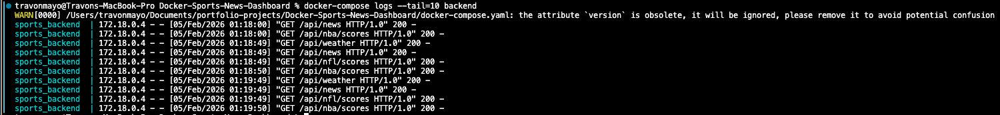

**Real-time monitoring:**
```bash
# Watch backend logs continuously
docker-compose logs -f --tail=10 backend
# Shows last 10 lines, then shows live logs that come after
```

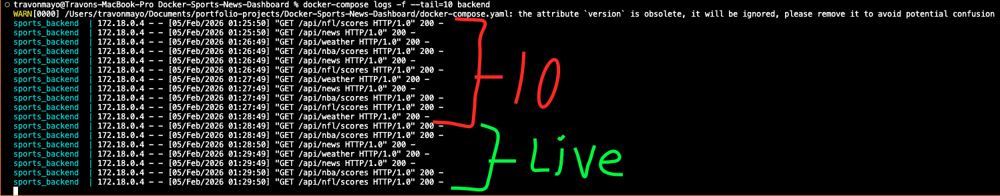

---

#### 3. Power User Commands

**Search logs for errors:**
```bash
docker-compose logs | grep -i error
docker-compose logs backend | grep -i "exception"
```

**Show timestamps:**
```bash
docker-compose logs -t backend
# Output: 2026-02-04T18:32:22.123456Z [notice] nginx started
```

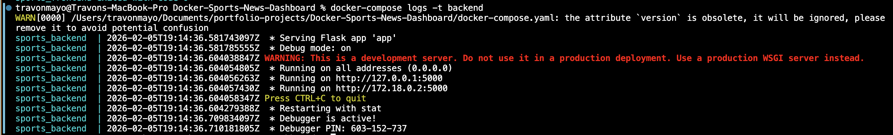

**View logs from specific time:**
```bash
# Last 5 minutes
docker-compose logs --since 5m

# Since specific time
docker-compose logs --since 2026-02-04T18:00:00

# Between two times
docker-compose logs --since 18:00 --until 19:00
```

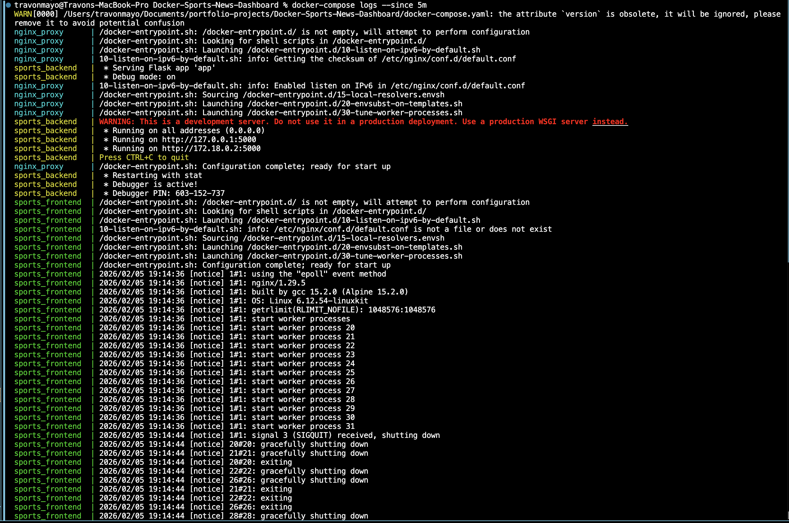

**Export logs to file:**
```bash
# All logs
docker-compose logs > app-logs.txt

# Specific container
docker-compose logs backend > backend-logs.txt

# With timestamps
docker-compose logs -t > app-logs-$(date +%Y%m%d).txt
```

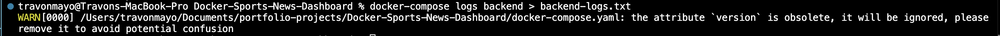

**The File created from that command:**

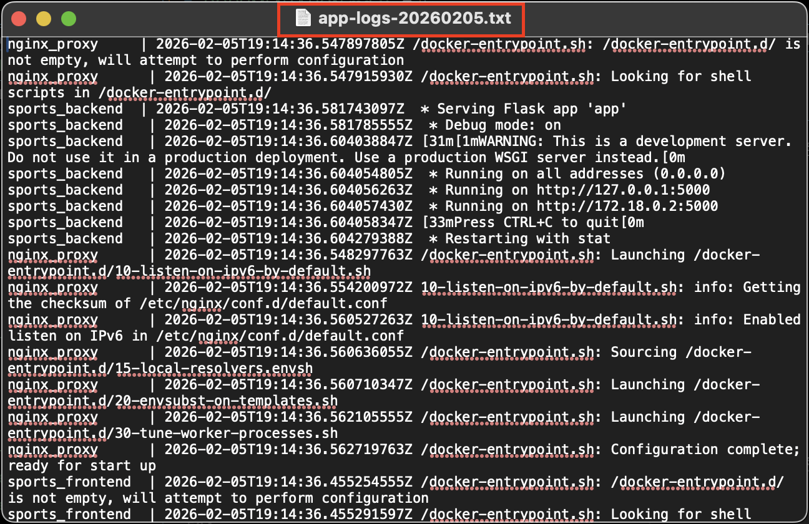

**Multi-container monitoring:**
```bash
# Watch multiple containers
docker-compose logs -f backend frontend

# Color-coded output
docker-compose logs -f --no-log-prefix
```

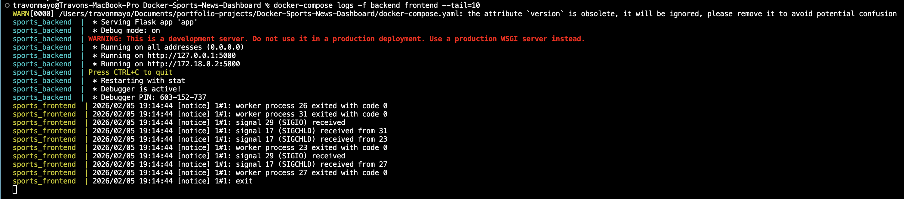

---

### Container Lifecycle Management

#### Starting Containers
```bash
# Build images and start containers
docker-compose up --build

# Start in background (detached mode)
docker-compose up -d

# Start specific services only
docker-compose up backend db

# Force rebuild even if images exist
docker-compose up --build --force-recreate
```


#### Stopping Containers
```bash
# Gracefully stop all containers
docker-compose down
```

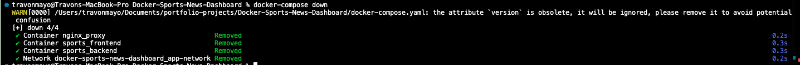

**What `down` does:**
1. Stops all running containers
2. Removes containers
3. Removes networks
4. Preserves volumes and images

**More stop options:**
```bash
# Stop but don't remove containers
docker-compose stop

# Stop and remove volumes too
docker-compose down -v

# Force stop (kill immediately)
docker-compose down --timeout 0
```

#### Container Status
```bash
# List running containers
docker-compose ps

# List all containers (including stopped)
docker ps -a

# Show container resource usage
docker stats
```

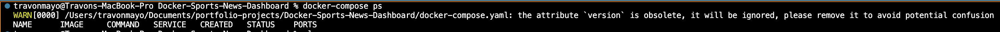

---

### Image Management

**Why manage images?**
- Images take up disk space (can be GBs)
- Old unused images accumulate over time
- Clean system = faster builds

#### Viewing Images
```bash
# List all Docker images
docker images
```

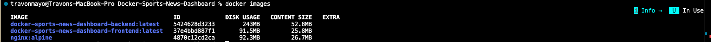

**Output columns explained:**
- `REPOSITORY` - Image name
- `TAG` - Version (latest, v1.0, etc.)
- `IMAGE ID` - Unique identifier
- `CREATED` - When image was built
- `SIZE` - Disk space used

#### Removing Images

**After stopping containers, images remain:**

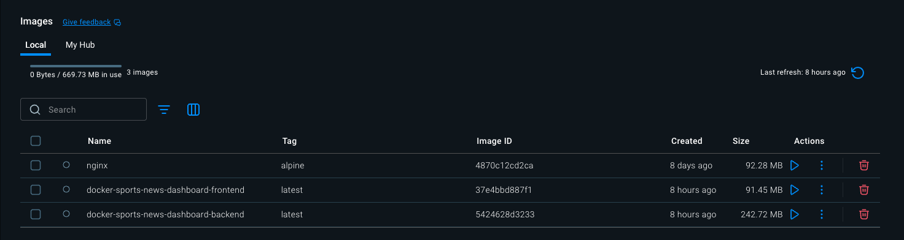

**Remove by ID or name:**
```bash
# By ID
docker rmi abc123def456

# By name
docker rmi docker-sports-news-dashboard-backend

# By name and tag
docker rmi docker-sports-news-dashboard-backend:latest
```

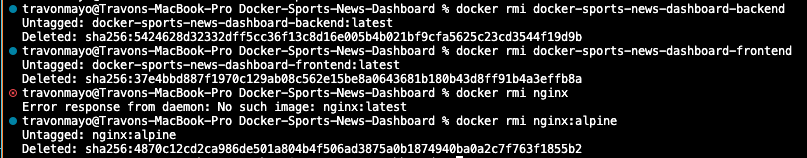

**Bulk removal:**
```bash
# Remove all unused images
docker image prune

# Remove all images (dangerous!)
docker image prune -a

# Remove everything (images, containers, volumes, networks)
docker system prune -a --volumes
```

**Verify removal:**


---

### Best Practices for Container Management

| Practice | Why | Command |
|----------|-----|---------|
| **Use `.dockerignore`** | Reduce build context size | Create `.dockerignore` file |
| **Tag images properly** | Easy identification | `docker build -t myapp:v1.0` |
| **Clean up regularly** | Free disk space | `docker system prune` |
| **Use volumes for data** | Persist data between restarts | Define volumes in compose |
| **Health checks** | Auto-restart failing containers | Add `healthcheck` in compose |
| **Resource limits** | Prevent one container hogging resources | Set CPU/memory limits |
| **Read-only filesystems** | Security hardening | `read_only: true` in compose |

---

## 📸 Live Dashboard

### Weather Widget

Real-time weather for Charlotte, NC powered by OpenWeather API:

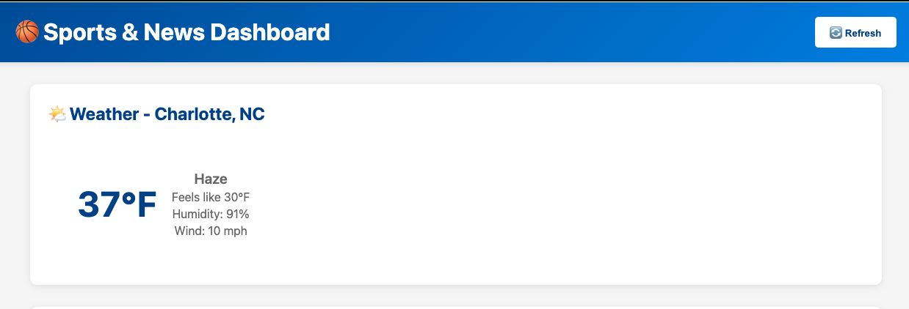

**Data displayed:**
- Current temperature
- Feels like temperature
- Weather description (Partly Cloudy, Clear, Rain, etc.)
- Humidity percentage
- Wind speed in mph

---

### NBA Scores

Live and scheduled NBA games with team logos, scores, and game status:

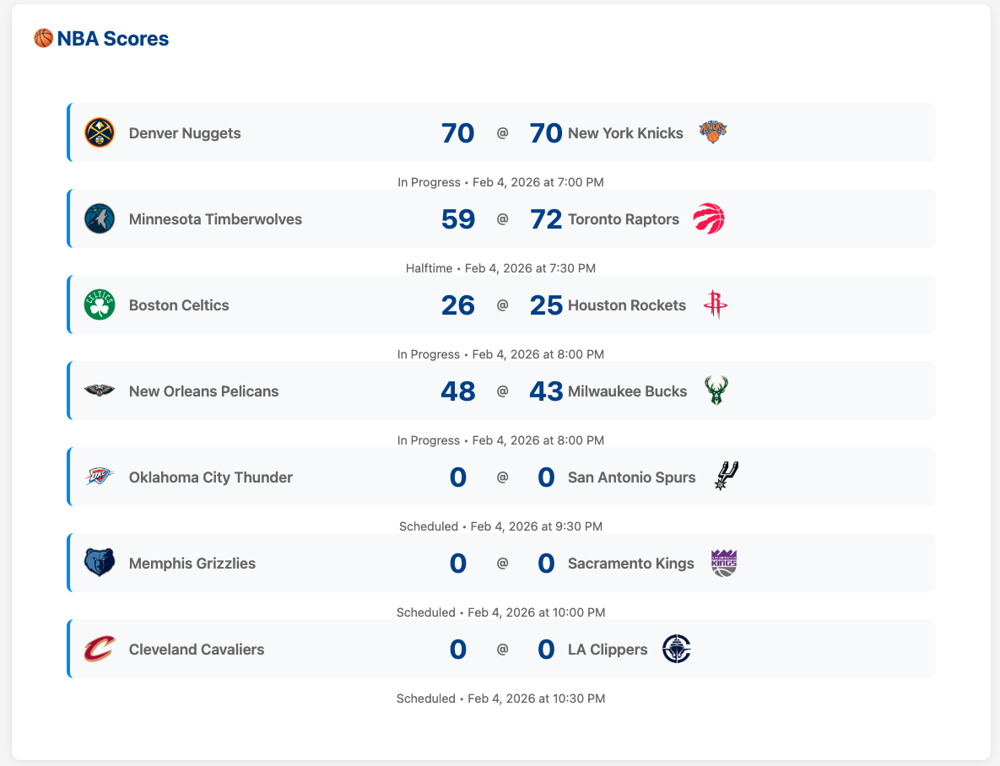

**Features:**
- Team names and logos
- Live scores (updates every 60 seconds)
- Game status (Scheduled, In Progress, Final)
- Date and time for each game

---

### NFL Scores

Current NFL games with same features as NBA:

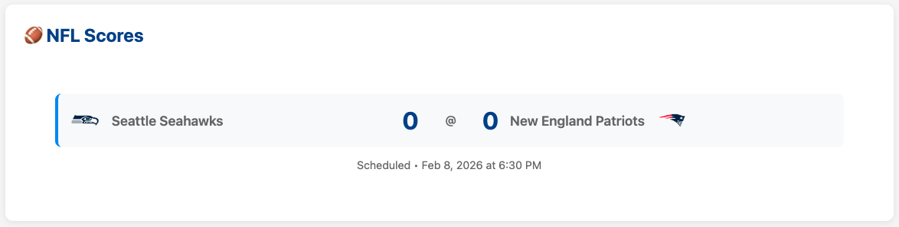

**Features:**
- Team names and logos
- Live scores
- Game status
- Date and time

---

### News Headlines

Top 5 breaking news stories from NewsAPI:

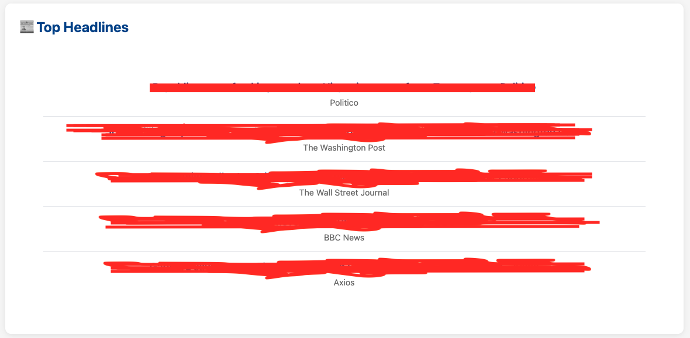

**Features:**
- Article titles
- News source
- Auto-refresh for latest stories

---

## 🎓 What I Learned

### Technical Skills

#### Docker Fundamentals
- ✅ **Containers vs Images** - Containers are running instances of images
- ✅ **Dockerfiles** - Write efficient multi-stage builds to reduce image size
- ✅ **Docker Compose** - Orchestrate multi-container applications with one command
- ✅ **Networking** - Containers communicate through Docker bridge networks using DNS
- ✅ **Volumes** - Persist data between container restarts
- ✅ **Port Mapping** - Understand host:container port relationships

#### DevOps Practices
- ✅ **Microservices Architecture** - Build services that scale independently
- ✅ **Container Health Checks** - Implement health endpoints for auto-recovery
- ✅ **Log Management** - Use both GUI and CLI tools for debugging
- ✅ **Troubleshooting** - Read error messages, check logs, verify configurations
- ✅ **Resource Management** - Monitor CPU/memory usage, clean up unused images
- ✅ **API Integration** - Aggregate data from multiple external APIs

#### System Administration
- ✅ **Port Conflict Resolution** - Diagnose and resolve port binding issues
- ✅ **Process Management** - Use `lsof`, `ps`, and Docker commands to manage resources
- ✅ **File System Operations** - Understand container file systems vs host file systems
- ✅ **Network Debugging** - Test connectivity between containers

---

### Soft Skills

#### Problem Solving
- **Methodical debugging** - Break problems into smaller pieces, test hypotheses
- **Reading documentation** - Official docs are more reliable than random tutorials
- **Error message analysis** - Errors tell you exactly what's wrong if you read carefully

#### Project Management
- **Iterative development** - Build one piece at a time, test, then move forward
- **Documentation** - Document as you go, not at the end
- **Version control** - Commit frequently with clear messages

---

### Key Takeaways

| Lesson | Why It Matters |
|--------|----------------|
| **Start simple, then iterate** | Trying to build everything at once leads to confusion |
| **Errors are learning opportunities** | Every error teaches you something about the system |
| **Logs are your best friend** | 90% of debugging is reading logs carefully |
| **Port conflicts are common** | Always check `lsof -i :<port>` on Mac/Linux |
| **Docker != Production** | Development mode is fine for learning, but use proper WSGI servers (gunicorn) in production |
| **Microservices = Isolation** | Each service can fail, update, scale independently |

---

## 🚀 What's Next

### Immediate
- [ ] Add `.env` file for secure API key management
- [ ] Implement caching to reduce API calls
- [ ] Write unit tests for backend endpoints

### Short Term
- [ ] **Deploy to Kubernetes** (the original goal)
- [ ] Add Prometheus/Grafana monitoring
- [ ] Implement CI/CD with GitHub Actions
- [ ] Container security scanning with Trivy

### Long Term
- [ ] Learn Helm for Kubernetes package management
- [ ] Implement service mesh with Istio
- [ ] Add user authentication and favorite teams
- [ ] Mobile app version

---

## 📚 Resources Used

### Official Documentation
- [Docker Documentation](https://docs.docker.com/) - Comprehensive Docker guides
- [Docker Compose](https://docs.docker.com/compose/) - Multi-container orchestration
- [Nginx Documentation](https://nginx.org/en/docs/) - Nginx configuration reference
- [Flask Documentation](https://flask.palletsprojects.com/) - Flask API framework

### APIs
- [ESPN API](https://gist.github.com/nntrn/ee26cb2a0716de0947a0a4e9a157bc1c) - Sports scores (unofficial)
- [OpenWeather API](https://openweathermap.org/api) - Weather data
- [NewsAPI](https://newsapi.org/docs) - News headlines

### Learning Resources
- [Docker Tutorial for Beginners](https://www.youtube.com/watch?v=fqMOX6JJhGo) - Comprehensive video guide
- [Microservices Architecture](https://microservices.io/) - Patterns and best practices
- [Nginx Beginner's Guide](http://nginx.org/en/docs/beginners_guide.html) - Official guide

---

## 🤝 Contributing

This is a personal learning project, but suggestions are welcome!

**Found a bug?**
- Dont be afraid to let me know!

---

## 🤝 Connect With Me

<div align="center">

[](mailto:travondm2@gmail.com)
[](https://github.com/vonongit)
[](https://www.linkedin.com/in/travon-mayo/)

</div>

---

## APT References and Acknowledgments

- **ESPN** for providing free sports data APIs
- **OpenWeather** for weather API
- **NewsAPI** for news aggregation
- **Docker community** for excellent documentation
- **Stack Overflow** for troubleshooting help

---

**Stepping stone to Kubernetes learning**

*Last Updated: February 10, 2026*